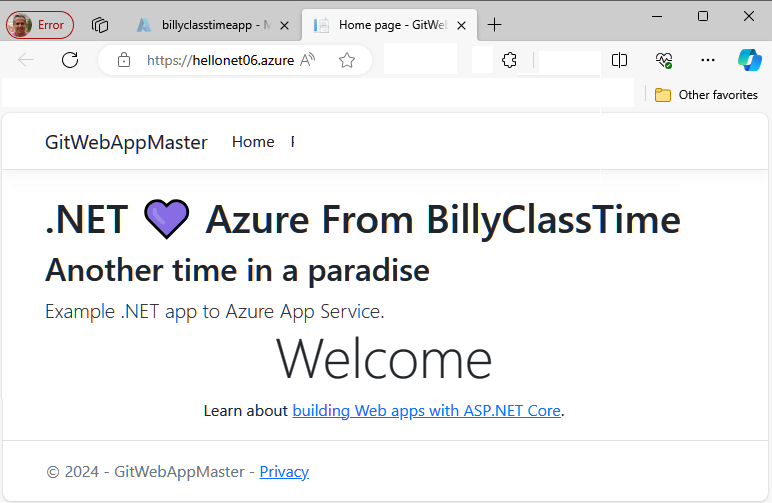

# Challenge for Azure Developer Students
Create a web project and upload it to Git for deployment on Azure App Service from a Git repository.

> **Note:** If you make changes in the code and want to deploy it, consider building with the following commands:
>
> `dotnet publish --configuration Release --output out`

**Compress destination path and its content:**

Compress-Archive -Path .\out\* -DestinationPath WebAppMasterDotNet6.zip -Force

## Create the specific resource for your web app before doing the deployment

**Resource Group:**

`az group create --name [ResourceGroup Name] --location [name]`

**Service Plan and Pricing:**

`az appservice plan create --name [plan name] --resource-group [ResourceGroup name] --sku B1 --is-linux`

> **Note:** To determine the available runtimes before deployment
>
> `az webapp list-runtimes --linux`

**Web App Services:**

`az webapp create -g [ResourceGroup name] -p [plan name] -n [webapp service name] --runtime DOTNETCORE:6.0"`

**Deploy to Azure (whether you have changed the code or not):**

`az webapp deployment source config-zip --resource-group [ResourceGroup Name] --src .\WebAppMasterDotNet6.zip --name [webapp service name]`

**Testing:**

If everything has gone well, you should be able to navigate to the URL of the App Service and see the following page.

## Conclusion

In this challenge, you have the opportunity to create a web project, upload it to Git, and deploy it on Azure App Service from a Git repository. Before deployment, build the project with specified commands, create necessary resources including a resource group, services plan, and pricing. Verify available runtimes with the provided command. Finally, deploy to Azure using the given deployment command, whether code changes were made or not.

**Happy Coding!**